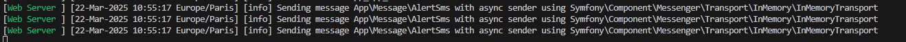

# Bienvenue sur le projet thunder_alert

Ceci est une application backend qui permet d’importer des destinataires depuis un fichier CSV vers une Base de Donnée, et de simuler des envois d'alertes météo par SMS à des particuliers ([cf. Spécifications.pdf](./Spécifications.pdf)).


## Pré-requis

- Installer Symfony-CLI 
- Installer PHP 8.4
- Installer Postgresql 17.4
- Installer pgAdmin 4 (Pour administrer la Base de Donnée PostgreSQL)

>**<u>Remarque :</u>** Le projet a été conçu sans l'aide de Docker. Il nécessite d'avoir un serveur Postgresql opérationnel et prêt à recevoir les requêtes de migration.


## Installation

- A la racine du projet, lancer la commande suivante :

    ```bash
        # Installera toutes les dépendances liées au projet
        Composer install
    ```

## Configuration

- Configurer votre serveur Postgresql

    - Via PgAdmin, créer un utilisateur que l'application pourra utiliser pour exécuter le script de migration et envoyer les requêtes SQL par la suite.

    - Via PgAdmin, créer une nouvelle base de données
        >Pour ne pas modifier la config, utiliser le nom `thunder_alert`

    - Modifier si besoin dans le fichier `.env` à la racine du projet, les configurations suivantes en cohérence avec les configurations du serveur PostgreSQL et de la base de données que vous souhaitez utiliser  : `DB_HOST`, `DB_PORT`, `DB_USER`, `DB_PWD`, `DB_NAME` et `DATABASE_URL`.

- Lancer la migrations du model vers la nouvelle BDD créée
    ```bash
        # Assurez-vous que le serveur PostgreSQL est en fonctionnement
        symfony console sql-migrations:execute
    ```

## Lancement du projet
 
- A la racine du projet, lancer le serveur Symfony avec la commande suivante :
    ```bash
        symfony server:start
    ```

## Utilisation des fonctionnalités développées

### I. Import des contacts depuis un fichier CSV vers la table `contacts` de la BDD

- Ouvrir un terminal, et lancer la commande suivante
    ```bash
        symfony console app:import-contact <csv_file_path>
    ```
    Le paramètres `<csv_file_path>` peut être un chemin absolu ou relatif.
    > **<u>Attention :</u>** 
    >- Si vous écrivez un chemin relatif, celui-ci sera relatif à la racine du projet.  
    Il est donc conseillé de **se placer à la racine du projet** avec le terminal.
    >
    >- S'assurer que les séparateurs de colonnes utilisés dans le fichier `.csv` soient bien les mêmes que ceux configurés dans la variable `TODO` du fichier `.env` 

**Les résultats de chaque utilisation de la commande sont loggés dans le fichier `/log/Import.log`**

### II. Utilisation du endpoint HTTP `/alerter` pour simuler l'envoi de messages

- S'assurer que le serveur local symfony est bien en service 
- Appeler le endpoint HTTP `/alerter` en `GET` (via un navigateur ou un logiciel de type Postman) de la manière suivante :  

    > http://**`%server_host%`**:**`%server_port%`**/alerter?insee=**`%insee%`**&api_key=**`%api_key%`**
    >
    > - **%server_host%** : `localhost` si serveur lancé en local, sinon `dns` du serveur
    > 
    > - **%server_port%** : Port du serveur si lancé en local (8000 si lancé avec le serveur symfony)
    >
    >- **%insee%** : Code insee des numéros de téléphones auxquels on souhaite envoyer l'alerte SMS. (Stockés dans la table `contacts` de la BDD).
    > - **%api_key%** : Clé API configurée via la configuration `API_KEY` dans le fichier `.env` à la racine du projet.

**La requête renvoie une réponse au format JSON suivant :** 
```json
{
   "code": "OK ou <error_code>",
   "message": "Envoi d'un sms d'alerte à %x personnes OU <error_msg> en case d'erreur"
}
```
**Le serveur se charge ensuite d'envoyer des demandes d'envois de SMS de manière asynchrone à un service `SMSService`, qui, si le processus aboutit, se charge de logger chaque envoi de SMS dans le fichier `/log/sms_history.log`**.

>**<u>Remarque :</u>** Dans la version livrée, le système de `dispatch/handle` fonctionne avec une configuration **synchrone**, car je n'ai pas réussi faire fonctionner la configuration **asynchrone** (cf. section Problèmes rencontrés ci-dessous).

## Problèmes rencontrés

### Système de dispatch/handle de messages, asynchrone via Symfony Messenger

Dans la version livrée, le contrôleur du endpoint `/alerter` se charge de `dispatcher` un message d'envoi de SMS (`App\Message\AlertSms`) à un bus de message géré par Symfony messenger (Configuré dans le fichier `/config/packages/messenger.yaml`).  
Ce message est ensuite catché par un `handler` à l'écoute des messages transitant sur ce bus (`App\MessageHandler\AlertSmsHandler`).  
Le handler se charge par la suite d'appeler le service (`App\Service\SmsService`), qui se charge de simuler l'envoi du SMS (Log de l'envoi dans `/log/sms_history.log`).

>**<u>Problème :</u>**  
>
>Je n'ai pas réussi à faire fonctionner le dispatch/handle des messages de manière asynchrone :
>   
> Quand j'active le routing de tous les messages provenant du namespace `App\Message\*` vers le transport `async` `in-memory://` (décommenter la ligne 22 du fichier `/config/packages/messenger.yaml`) ; et que je lance le `worker` permettant de consommer les messages envoyés via ce transport (`symfony console messenger:consume`) ; les messages que j'envoie vers ce transport ne sont pas consommés par ce `worker`.
>
> Je vois bien dans les logs du serveur symfony (cf. image ci-dessous), que les messages sont bien envoyés au transport `async` `in-memory://`, mais le `worker` en écoute sur ce transport, ne réagit pas du tout, et le handler `App\MessageHandler\AlerSmsHandler` n'est jamais déclenché non plus.  
>
>
>J'ai pensé que le problème venait du transport `in-memory://`, et j'ai donc installé le package `zenstruck/messenger-test` qui était censé me proposer un autre transport de test via la DSN `test://`.   
>Cependant je n'ai pas réussi à lancer de `worker` permettant de consommer les messages provenant de ce tranport (La commande `symfony console messenger:consume` part en erreur).
>
>**J'ai malheureusement dû en rester là, et livrer le système en conservant la configuration synchrone.**

## Axes d'amélioration

- Améliorer la gestion des Erreurs / Exceptions
- Améliorer la traçabilité des actions (Système de Logger à améliorer => Voir comment faire avec le loggeur Symfony ou Monolog)
- Empêcher l'insertion de doublons dans la table contacts
- Faire une insertion en lots plutôt que d'insérer les lignes une par une (Meilleures performances)
- Ajouter la gestion du code pays dans les numéros de téléphone
- Utiliser PDO pour les transactions BDD (Doctrine interdit => Pas voulu utiliser PDO)
- Protéger le point d'entrée /alerter des injections SQL (Utiliser PDO)
- Utiliser un template pour l'envoi des messages
- Implémenter des tests unitaires